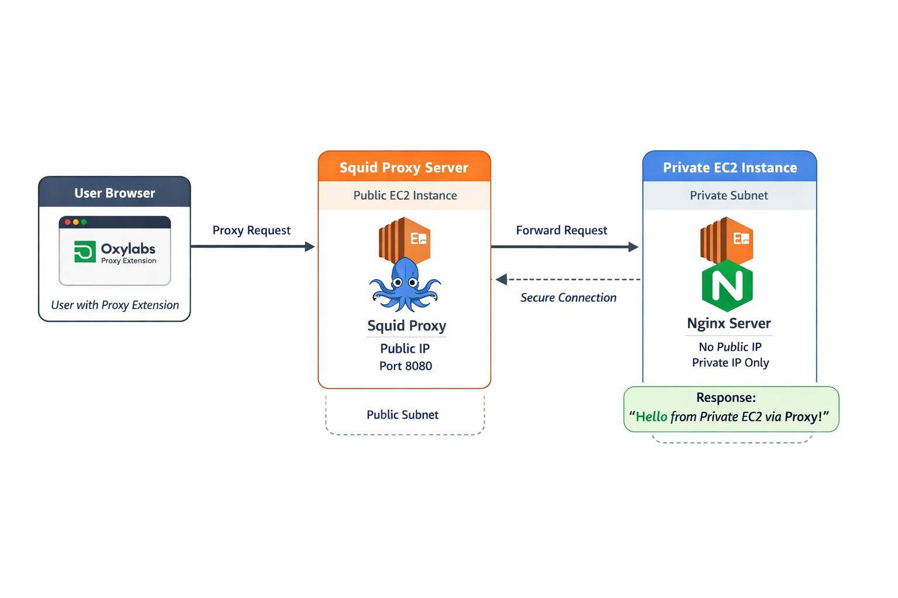

# 🚀 Private EC2 Access via Squid Proxy (AWS + Terraform)

## 📌 Overview

A **proxy server** acts as an intermediary between your device and the internet or a private network. It **forwards requests on behalf of the client** and can provide:

* **Access control:** Restrict who can reach internal resources
* **Security:** Hide internal IPs from external networks
* **Caching & Performance:** Reduce repeated traffic to the same server

**Squid Proxy** is a popular, high-performance caching and forwarding proxy for web clients. It can:

* Run on a **public EC2 instance** to act as a secure gateway
* Forward requests to **private servers** without exposing them to the internet
* Control access using IP restrictions or authentication
* Log traffic for auditing purposes

In this project, Squid Proxy enables **secure access to a private EC2-hosted Nginx server** without assigning it a public IP, demonstrating **network isolation, security, and controlled access** in AWS.

---

## 🧠 Core Concepts Used

* AWS VPC (Virtual Private Cloud)
* Public vs Private Subnets
* EC2 Instances
* Security Groups & Networking
* Squid Proxy Server
* Nginx Web Server
* HTTP Proxying
* Terraform (Infrastructure as Code)
* Browser Proxy Configuration (Oxylabs Extension)

---

## 🏗️ Architecture Diagram


---

## 🔄 Request Flow (How it Works)

```
[ User Browser ]
        │
        │ (Configured Proxy)
        ▼
[ Squid Proxy EC2 - Public Subnet ]
        │
        │ (Forward Request)
        ▼
[ Private EC2 - Nginx Server ]
        │
        │ (Response)
        ▼
[ Squid Proxy ]
        │
        ▼
[ User Browser ]
```

---

## 📊 Flow Explanation (Step-by-Step)

1. User installs **Oxylabs Chrome Proxy Extension**
2. Proxy is configured using:

   * Public IP of Squid EC2
   * Port: `8080`
3. User enters private EC2 IP in browser
4. Request goes to → Squid Proxy (Public EC2)
5. Squid forwards request to → Private EC2 (Nginx)
6. Nginx responds with:

   ```
   Hello from Private EC2 via Proxy!
   ```
7. Response flows back → Squid → Browser

---

## ⚙️ Infrastructure Components

### 1. VPC Setup

* Custom VPC (e.g., `10.0.0.0/16`)

### 2. Subnets

* Public Subnet (for proxy)
* Private Subnet (for application)

### 3. Internet Gateway

* Attached to Public Subnet

### 4. Route Tables

* Public subnet → Internet Gateway
* Private subnet → No direct internet access

---

## 🖥️ EC2 Instances

### 🔒 Private EC2 (Nginx Server)

* No Public IP
* Runs inside Private Subnet
* Installed:

  * Nginx
* Serves:

  ```
  Hello from Private EC2 via Proxy!
  ```

---

### 🌐 Public EC2 (Squid Proxy Server)

* Has Public IP
* Runs inside Public Subnet
* Installed:

  * Squid Proxy
* Listens on:

  ```
  Port 8080
  ```

---

## 🔐 Security Configuration

### Private EC2 Security Group

* Allow HTTP (Port 80)
* Source: Squid EC2 (Security Group or Private IP)

### Squid EC2 Security Group

* Allow:

  * Port 8080 (from your IP)
  * SSH (Port 22)

---

## 🧰 Installation Scripts

### Nginx (Private EC2 - Ubuntu)

```bash
#!/bin/bash
apt update -y
apt install nginx -y
systemctl enable nginx
systemctl start nginx
echo "Hello from Private EC2 via Proxy!" > /var/www/html/index.html
```

---

### Squid Proxy (Public EC2 - Ubuntu)

```bash
#!/bin/bash
apt update -y
apt install squid -y
systemctl enable squid
systemctl start squid
```

---

## 🌍 Browser Configuration

### Oxylabs Proxy Extension Setup:

* Host: `PUBLIC_EC2_IP`
* Port: `8080`

---

## ✅ Testing

1. Open browser
2. Enable proxy
3. Enter:

   ```
   http://PRIVATE_EC2_IP
   ```
4. Expected Output:

   ```
   Hello from Private EC2 via Proxy!
   ```

---

## ⚠️ Common Issues & Fixes

| Issue                     | Cause                   | Solution                      |
| ------------------------- | ----------------------- | ----------------------------- |
| Cannot access private EC2 | Security group blocking | Allow traffic from proxy      |
| Proxy not working         | Squid not running       | Restart squid service         |
| Timeout                   | Wrong route table       | Verify subnet routing         |
| Access denied             | Squid config issue      | Check `/etc/squid/squid.conf` |

---

## 📦 Tools & Technologies

* AWS EC2
* Terraform
* Ubuntu Linux
* Nginx
* Squid Proxy
* Chrome Extension (Oxylabs)

---

## 🎯 Key Learnings

* Implementing secure architectures using private subnets
* Accessing internal services via proxy servers
* Real-world DevOps networking patterns
* Using Terraform for infrastructure automation

---

## 📌 Conclusion

This project showcases a **secure, production-grade architecture** where internal services are protected and only accessible through controlled proxy access.

Such patterns are widely used in:

* Enterprise internal systems
* Secure dashboards
* Microservices architectures

---

If you want, I can now **add Terraform code with Squid authentication**, and make it **interview-ready**, including **best commit messages and README polish** for maximum impact.

---

If you want, I can prepare the **diagram in a more professional, GitHub-friendly style** too.

Do you want me to do that next?
